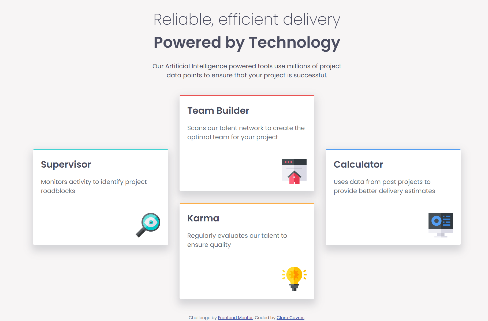
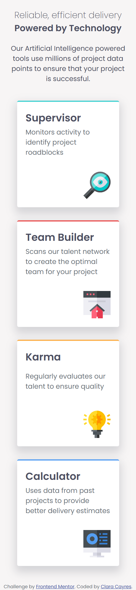

# Frontend Mentor - Four card feature section solution

This is my solution to the [Four card feature section challenge](https://www.frontendmentor.io/challenges/four-card-feature-section-weK1eFYK) on Frontend Mentor. This challenge helped me practice building responsive layouts using HTML and CSS.

## 📑 Table of Contents

- [Overview](#overview)
  - [The Challenge](#the-challenge)
  - [Screenshot](#screenshot)
  - [Links](#links)
- [My Process](#my-process)
  - [Built With](#built-with)
  - [What I Learned](#what-i-learned)

---

## 📌 Overview

This project is a solution to the Four card feature section challenge on Frontend Mentor. The goal was to recreate a responsive layout showcasing four features, using semantic HTML and modern CSS techniques like Grid and Flexbox.

The challenge helped me practice:

Creating responsive layouts that adapt well across screen sizes

Working with Grid to position elements precisely

Writing clean, maintainable CSS with custom properties

### The Challenge

Users should be able to:

- View the optimal layout for the page depending on their device's screen size.

### Screenshot

#### Desktop



#### Mobile

## 

### Links

- Solution URL: [View on GitHub](https://github.com/claracayres/four-card-feature-section-main)
- Live Site URL: [View Live Site](https://claracayres.github.io/four-card-feature-section-main)

---

## 🚀 My Process

I started the project by analyzing the design provided by Frontend Mentor. I first created the HTML structure to make sure the layout was semantically correct and accessible.

After that, I moved on to styling:

Base styles – I added global styles such as font-family, background color, and text alignment.

Mobile-first approach – I built the mobile layout first using Flexbox for stacking and alignment.

Responsive layout with CSS Grid – For the desktop view, I used CSS Grid to position the cards in a three-column layout with the middle two stacked.

Final refinements – I adjusted spacing, colors, and font sizes to match the design as closely as possible.

Throughout the process, I paid special attention to keeping the CSS clean and reusable, and I tested the layout across different screen sizes.

### Built With

- Semantic HTML5
- CSS Custom Properties
- Flexbox
- CSS Grid
- Mobile-first workflow

### What I Learned

One of the main things I practiced in this challenge was combining CSS Grid and Flexbox to create a balanced, responsive layout. A key part was positioning the middle two cards vertically while keeping the outer cards centered between rows.

```css
.cards-grid {
  display: grid;
  grid-template-columns: 1fr 1fr 1fr;
  grid-template-rows: auto auto;
  gap: 30px;
  width: 100%;
  max-width: 1200px;
  padding: 20px;
}
```
---
Built by Clara Cayres 💜